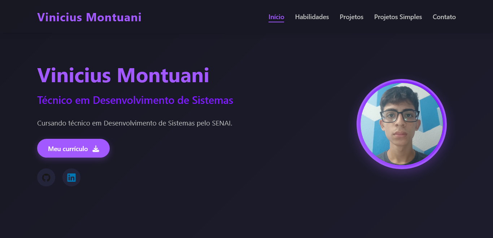

# Portfólio de Projetos — Curso de Desenvolvimento de Sistemas | SENAI

## Acesse o projeto online

---

## Sobre este repositório

Este repositório reúne os projetos desenvolvidos durante meu curso técnico de Desenvolvimento de Sistemas no SENAI, além de estudos e experimentos realizados por iniciativa própria. Estou documentando aqui minha jornada como desenvolvedor em formação.

Atualmente possuo conhecimentos consolidados em **HTML**, **CSS** e **Git**, e estou em processo de aprendizado em **Python**, **JavaScript** e **C#** (explorado de forma paralela). Tenho o objetivo de explorar o maior número possível de linguagens de programação, nas quais possuo algum interesse como: C e Java
---

## Objetivos

- Consolidar os conhecimentos adquiridos no curso SENAI.
- Registrar de forma organizada minha evolução prática.
- Aprender e testar diversas linguagens, paradigmas e ferramentas.
- Manter um portfólio técnico acessível e bem documentado.

---

## Tecnologias já utilizadas neste repositório

Lista das tecnologias e linguagens que já apareceram em algum projeto deste portfólio:

  
  
  
  
  
  
  
  
  
  

Essa lista será atualizada conforme novos projetos forem sendo incluídos.

---

## Como navegar

1. Acesse a pasta da linguagem ou tecnologia desejada.
2. Abra o projeto de interesse.
3. Consulte o `README.md` individual para detalhes técnicos e contexto.

---

## Agradecimentos

Este repositório é fruto do apoio de colegas, professores e da estrutura oferecida pelo SENAI. Agradeço especialmente aos colaboradores indiretos — amigos que deram sugestões, críticas construtivas e feedbacks técnicos, e aos materiais abertos da comunidade de desenvolvedores que têm sido base para meu estudo autodidata.

---

## Autor

**Vinicius Montuani**  
Estudante técnico em Desenvolvimento de Sistemas | SENAI  

